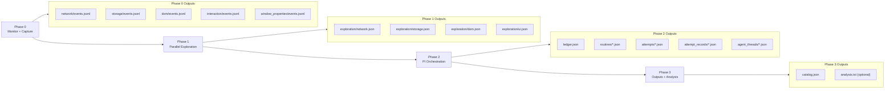
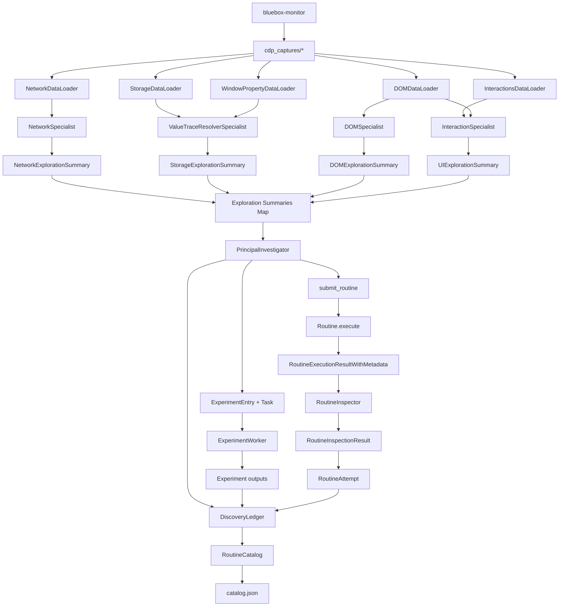

# API Indexing

This document describes the current API indexing system as implemented in:

- `bluebox/scripts/api_indexing/run_api_indexing.py`
- `bluebox/agents/principal_investigator.py`
- `bluebox/agents/workers/experiment_worker.py`
- `bluebox/agents/routine_inspector.py`

## General Overview (Capture + Monitoring First)

API indexing starts with browser monitoring and asset collection, then runs multi-agent synthesis on captured artifacts. This mirrors the monitor-first approach in `docs/routine_discovery.md`.

Capture command:

```bash
bluebox-monitor --host 127.0.0.1 --port 9222 --output-dir ./cdp_captures --url about:blank --incognito
```

Expected capture tree:

```text
cdp_captures/
├── session_summary.json
├── network/
│   ├── events.jsonl
│   └── javascript_events.jsonl
├── storage/
│   └── events.jsonl
├── dom/
│   └── events.jsonl
├── interaction/
│   └── events.jsonl
└── window_properties/
    └── events.jsonl
```

Main pipeline command:

```bash
bluebox-api-index \
  --cdp-captures-dir ./cdp_captures \
  --task "Recover and validate routines from this captured session"
```

## Agents Involved

### Orchestration Boundary (Important)

Phase 2 has exactly one orchestrator:

- `PrincipalInvestigator` (PI)

`ExperimentWorker` and `RoutineInspector` are execution subagents. They do not orchestrate global flow, do not own catalog lifecycle, and do not decide completion.

### Shared Base Tool Families (from `AbstractAgent`)

Any agent may get these, depending on constructor flags/context:

- `list_files` — List files in workspace or docs.
- `read_file` — Read file content by path.
- `search_files` — Search text across files.
- `execute_python` — Run sandboxed Python analysis code.
- `add_note` — Attach note to finalized wrapper.
- `finalize_with_output` — Finalize with schema-validated output object.
- `finalize_with_failure` — Finalize schema task with failure reason.
- `finalize_result` — Finalize with freeform output object.
- `finalize_failure` — Finalize freeform task with failure reason.

Prompt plumbing automatically injected by base class:

- `## Tools` (available tools list at runtime)
- workspace usage guidance (if workspace exists)
- documentation index section (if docs loader exists)

### Agent: `NetworkSpecialist` (Phase 1)

Role:

- Network-domain exploration and endpoint triage.

Custom tools:

- `search_responses_by_terms` — Rank responses by term relevance.
- `get_entry_detail` — Return full request and response details.
- `get_response_body_schema` — Infer JSON response structure and types.
- `get_unique_urls` — List unique URLs with request counts.
- `search_requests_by_terms` — Rank requests by matching request terms.
- `search_response_bodies` — Find value matches in response bodies.

Inherited tools in current pipeline runs:

- `execute_python` — Run sandboxed Python over capture context.
- `list_files` — List workspace or docs files.
- `read_file` — Read file content by path.
- `search_files` — Search text in files.
- `add_note` — Attach note before finalization.
- `finalize_with_output` — Submit schema-validated final output.
- `finalize_with_failure` — Submit schema-task failure reason.

Data access:

- `NetworkDataLoader` (`network/events.jsonl`)
- mounted workspace input (typically `raw/network_events.jsonl`)

Prompt sections:

- `SYSTEM_PROMPT` / `AUTONOMOUS_SYSTEM_PROMPT` mission blocks
- `## Network Traffic Context`
- `## Likely Important API Endpoints` / `## Likely API Endpoints`
- `## Host Statistics`
- output schema + urgency in autonomous mode

### Agent: `ValueTraceResolverSpecialist` (Phase 1 Storage/Window)

Role:

- Trace token/value origins across network, storage, and window properties.

Custom tools:

- `search_everywhere` — Search value across all available sources.
- `search_in_network` — Search value inside network responses.
- `search_in_storage` — Search value in storage events.
- `search_in_window_props` — Search value in window property history.
- `get_network_entry` — Return full network transaction by ID.
- `get_storage_entry` — Return one storage event by index.
- `get_window_prop_changes` — Return changes for one window path.
- `get_storage_by_key` — Return events for specific storage key.

Inherited tools in current pipeline runs:

- `list_files` — List workspace or docs files.
- `read_file` — Read file content by path.
- `search_files` — Search text in files.
- `add_note` — Attach note before finalization.
- `finalize_with_output` — Submit schema-validated final output.
- `finalize_with_failure` — Submit schema-task failure reason.
- `execute_python` — Configurable; disabled in storage exploration runner.

Data access:

- `StorageDataLoader` (`storage/events.jsonl`) when present
- `WindowPropertyDataLoader` (`window_properties/events.jsonl`) when present
- optional `NetworkDataLoader` for cross-reference
- mounted workspace inputs for available raw captures

Prompt sections:

- `SYSTEM_PROMPT` / `AUTONOMOUS_SYSTEM_PROMPT` mission blocks
- `## Data Store Context` with per-source availability/stats
- output schema + urgency in autonomous mode

### Agent: `DOMSpecialist` (Phase 1)

Role:

- DOM structure exploration (pages/forms/elements/scripts/tables).

Custom tools:

- `list_pages` — List captured pages with metadata.
- `get_elements` — Return typed DOM elements from snapshots.
- `get_forms` — Return forms with fields and actions.
- `get_tables` — Return tables with headers and counts.
- `get_scripts` — Return script tags and inline blobs.
- `get_text_content` — Return extracted text from snapshot.
- `search_strings` — Search text across DOM snapshots.
- `get_snapshot_diff` — Compare two snapshots for structural changes.
- `get_navigation_sequence` — Return ordered page transition sequence.

Inherited tools in current pipeline runs:

- `list_files` — List workspace or docs files.
- `read_file` — Read file content by path.
- `search_files` — Search text in files.
- `add_note` — Attach note before finalization.
- `finalize_with_output` — Submit schema-validated final output.
- `finalize_with_failure` — Submit schema-task failure reason.
- `execute_python` — Not enabled for this agent.

Data access:

- `DOMDataLoader` (`dom/events.jsonl`)
- mounted workspace input (`raw/dom_events.jsonl`)

Prompt sections:

- `SYSTEM_PROMPT` / `AUTONOMOUS_SYSTEM_PROMPT` mission blocks
- `## DOM Data Context`
- output schema + urgency in autonomous mode

### Agent: `InteractionSpecialist` (Phase 1)

Role:

- Interaction exploration and user-intent reconstruction.

Custom tools:

- `get_interaction_summary` — Summarize interaction event counts and types.
- `search_interactions_by_type` — Filter events by interaction type.
- `search_interactions_by_element` — Filter events by element attributes.
- `get_interaction_detail` — Return one interaction event details.
- `get_form_inputs` — Extract typed and selected form values.
- `get_unique_elements` — List unique interacted elements.
- `list_pages` — List pages for interaction context.
- `get_inputs` — Return input elements from DOM snapshots.
- `get_buttons` — Return button elements from DOM snapshots.
- `get_links` — Return link elements from DOM snapshots.
- `get_forms` — Return form elements from DOM snapshots.
- `get_tables` — Return table elements from DOM snapshots.
- `get_headings` — Return heading structure from DOM snapshots.
- `get_navigation_sequence` — Return captured page navigation sequence.
- `search_strings` — Search DOM strings for supporting clues.

Inherited tools in current pipeline runs:

- `list_files` — List workspace or docs files.
- `read_file` — Read file content by path.
- `search_files` — Search text in files.
- `add_note` — Attach note before finalization.
- `finalize_with_output` — Submit schema-validated final output.
- `finalize_with_failure` — Submit schema-task failure reason.
- `execute_python` — Not enabled for this agent.

Data access:

- `InteractionsDataLoader` (`interaction/events.jsonl`)
- optional `DOMDataLoader`
- mounted workspace inputs for available raw captures

Prompt sections:

- `SYSTEM_PROMPT` / `AUTONOMOUS_SYSTEM_PROMPT` mission blocks
- `## Interaction Data Context`
- optional `## DOM Data Context`
- output schema + urgency in autonomous mode

### Agent: `PrincipalInvestigator` (Phase 2 Orchestrator)

Role:

- Only orchestrator for Phase 2.
- Owns planning, experiment dispatch, attempt lifecycle, shipping, and completion.

Custom orchestration tools:

- `plan_routines` — Define routine specs to build.
- `set_active_routine` — Switch PI focus to one routine.
- `dispatch_experiment` — Run one worker experiment task.
- `dispatch_experiments_batch` — Run multiple worker experiments in parallel.
- `get_experiment_result` — Fetch a completed experiment output.
- `record_finding` — Store verdict summary and takeaways.
- `record_proven_artifact` — Save validated fetch/token/navigation evidence.
- `submit_routine` — Validate, execute, and inspect routine attempt.
- `mark_routine_shipped` — Mark passing attempt as shipped.
- `mark_routine_failed` — Mark routine failed with guardrails.
- `get_ledger` — Return current ledger state summary.
- `mark_complete` — Finalize catalog when all specs addressed.
- `mark_failed` — Fail entire pipeline when unrecoverable.

Inherited tools:

- `execute_python` — Run sandboxed Python for PI analysis.
- `list_files` — List workspace or docs files.
- `read_file` — Read docs or workspace file.
- `search_files` — Search docs or workspace text.
- no autonomous finalize tools (PI is conversational loop, `self.run` is the equivalent of autonomous mode)

Data access:

- exploration summaries (stored raw + toonified for prompt)
- `DiscoveryLedger` (global state)
- routine schema/docs index via `DocumentationDataLoader`
- workspace-mounted raw capture files under `agent_workspaces/PI/raw`
- orchestration runtime state (`Task` queue, subagent pool)

Prompt sections (PI system prompt build):

- `SYSTEM_PROMPT_CORE` (role, strategy, auth ordering, quality gates)
- optional `## Workspace Summary`
- `## Routine JSON Schema`
- routine JSON example block
- `## Worker Capabilities`
- code execution environment section
- `## Exploration Summaries`
- `## Discovery Ledger` (toon-encoded payload)
- `## Task Queue` (when non-empty)
- base-injected sections: tools list, workspace usage, docs index

### Agent: `ExperimentWorker` (Phase 2 Subagent)

Role:

- Execute PI-dispatched experiments using live browser + recorded capture context.

Custom tools:

- Live browser:
  - `browser_navigate` — Navigate tab and wait for load.
  - `browser_eval_js` — Execute JavaScript in live page.
  - `browser_cdp_command` — Send raw CDP method call.
  - `browser_get_dom` — Return filtered live DOM tree.
- Recorded lookups:
  - `search_recorded_transactions` — Search captured transactions by keywords.
  - `get_recorded_transaction` — Return captured transaction full details.
  - `search_recorded_storage` — Search captured storage events by value.
  - `trace_recorded_value` — Trace value across all recorded domains.
  - `get_recorded_dom_snapshot` — Return one captured DOM snapshot summary.
  - `get_recorded_dom_elements` — Return captured elements by type.

Inherited tools in current pipeline runs:

- `execute_python` — Run sandboxed Python during experiments.
- `list_files` — List workspace or docs files.
- `read_file` — Read file content by path.
- `search_files` — Search text in files.
- `add_note` — Attach note before finalization.
- `finalize_with_output` — Submit schema-validated final output.
- `finalize_with_failure` — Submit schema-task failure reason.

Data access:

- live browser tab (lazy-created, persistent per worker instance)
- network/storage/dom/window loaders when provided
- mounted raw capture files under worker workspace `raw/`

Prompt sections:

- conversational: `SYSTEM_PROMPT` + optional `## Workspace Summary` + `## Available Data Sources` + code execution section
- autonomous: `AUTONOMOUS_SYSTEM_PROMPT` + optional `## Workspace Summary` + `## Available Data Sources` + code execution + output schema + urgency

### Agent: `RoutineInspector` (Phase 2 Subagent)

Role:

- Independent quality gate for submitted routine attempts.

Custom tools:

- none (no inspector-specific tool handlers; relies on inherited tools)

Inherited tools in current pipeline runs:

- `execute_python` — Run sandboxed Python for inspection analysis.
- `list_files` — List workspace or docs files.
- `read_file` — Read docs or workspace file.
- `search_files` — Search docs or workspace text.
- `add_note` — Attach note before finalization.
- `finalize_with_output` — Submit schema-validated inspection result.
- `finalize_with_failure` — Submit inspection failure reason.

Data access:

- inspection prompt includes routine name/description/JSON + execution payload
- exploration summaries appended when available
- if execution payload is large, PI persists it to inspector workspace `raw/*.json` and inspector reads from file
- docs loader is supplied by PI, so docs tools are available

Prompt sections:

- `AUTONOMOUS_SYSTEM_PROMPT` rubric sections:
  - critical failure signals
  - spec downgrade detection
  - 6-dimension scoring rubric
  - verdict rules
  - documentation-backed recommendations
  - process checklist
- then base adds: output schema section, code execution section, docs index section, urgency section

## Data Models Involved

### Exploration Models (`bluebox/data_models/api_indexing/exploration.py`)

- `NetworkExplorationSummary`
- `StorageExplorationSummary`
- `DOMExplorationSummary`
- `UIExplorationSummary`
- supporting types: `EndpointCluster`, `EndpointCategory`, `InterestLevel`

### Core Orchestration Models (`bluebox/data_models/orchestration/*`)

`DiscoveryLedger` (`ledger.py`) is the PI’s source of truth:

- context: `user_task`
- plan state: `routine_specs`, `active_spec_id`
- experiment state: `experiments`, `proven`, `unresolved`
- attempt state: `attempts`
- terminal artifact: `catalog`

Routine/catalog lifecycle models:

- `RoutineSpec`, `RoutineSpecStatus`
- `RoutineAttempt`, `RoutineAttemptStatus`
- `RoutineCatalog`, `ShippedRoutine`

`RoutineCatalog` (final deliverable) key fields:

- `site`
- `user_task`
- `routines` (`ShippedRoutine[]`)
- `usage_guide`
- `failed_routines`
- `total_experiments`
- `total_attempts`

Experiment models:

- `ExperimentEntry`, `ExperimentStatus`, `ExperimentVerdict`
- `ExperimentTakeaway`
- `ProvenArtifacts`

Task/subagent models:

- `Task`, `TaskStatus`, `SpecialistAgentType`
- `SubAgent`

Inspection/result wrapper models:

- `RoutineInspectionResult`
- `SpecialistResultWrapper`

### Routine and Execution Models

- `Routine` (`bluebox/data_models/routine/routine.py`)
- `RoutineExecutionResultWithMetadata` (`bluebox/data_models/routine/execution.py`)

## Phase Overview

### Phase 0: Monitor and Capture Assets

1. Run browser monitor.
2. Produce domain JSONL artifacts under `cdp_captures/`.

### Phase 1: Parallel Exploration Specialists

1. Run network/storage/dom/ui exploration specialists in parallel.
2. Each returns validated structured summary.
3. Persist to `output_dir/exploration/{network,storage,dom,ui}.json`.

### Phase 2: PI-Led Orchestration

1. PI ingests exploration summaries and docs context.
2. PI plans routine specs, dispatches worker experiments, records findings.
3. PI submits routines for execute+inspect and ships/fails specs.
4. PI calls `mark_complete` to build final catalog.

### Phase 3: Durable Output and Analysis

Persisted outputs:

- `ledger.json`, `catalog.json`
- `experiments/`, `attempts/`, `attempt_records/`, `routines/`
- `agent_threads/` (PI/worker/inspector transcripts)
- `agent_workspaces/PI`, `agent_workspaces/worker_*`, `agent_workspaces/inspector_*`

Optional analysis:

- `analysis.txt` via `--post-run-analysis`

## Deep Dive: Phase 2 (PI Orchestration Internals)

### 1) PI Bootstraps State

- Load/initialize `DiscoveryLedger`.
- Build system prompt with exploration summaries + docs + ledger snapshot.
- If resuming after failure/context exhaustion, PI starts from preserved ledger.

### 2) PI Plans and Delegates

- Uses `plan_routines` to define catalog specs.
- Uses `dispatch_experiments_batch` (preferred) to create `ExperimentEntry` + `Task` pairs and run workers in parallel.
- Worker results are attached back to experiment outputs.

### 3) PI Consolidates Evidence

- `record_finding` adds verdict + summary + reusable takeaways.
- `record_proven_artifact` updates `ProvenArtifacts` for fetch/navigation/token/parameter evidence.

### 4) PI Builds and Submits Attempts

`submit_routine` pipeline:

1. documentation-quality gate
2. schema validation against `Routine`
3. live execution with `RoutineExecutionResultWithMetadata`
4. independent inspection via `RoutineInspector` (`RoutineInspectionResult`)
5. write `RoutineAttempt` with verdict and remediation data

Large execution payload handling:

- if payload exceeds PI threshold, PI writes it to inspector workspace `raw/`
- inspector is instructed to inspect from file using `execute_python` or `read_file`

### 5) PI Controls Terminal State

- `mark_routine_shipped`: attaches winning attempt to a spec
- `mark_routine_failed`: guarded by minimum failed-attempt evidence
- `mark_complete`: pipeline-level completion only (not per-spec)
  - requires all specs addressed
  - requires at least one shipped routine
  - builds `RoutineCatalog`

### 6) Persistence and Recovery

- PI calls persistence hooks on every ledger mutation.
- Pipeline writes incremental artifacts so crashes do not lose progress.
- `run_pi_with_recovery` recreates PI with preserved ledger for continuation.

### 7) Workspace Topology in Current Pipeline

Created by run script (not by agent classes):

- `agent_workspaces/PI`
- `agent_workspaces/worker_1`, `agent_workspaces/worker_2`, ...
- `agent_workspaces/inspector_1`, `agent_workspaces/inspector_2`, ...

All receive mounted capture inputs in `raw/`, enabling direct Python/file inspection during autonomous runs.

## Diagrams

### Phase Diagram



### Data Flow Diagram


